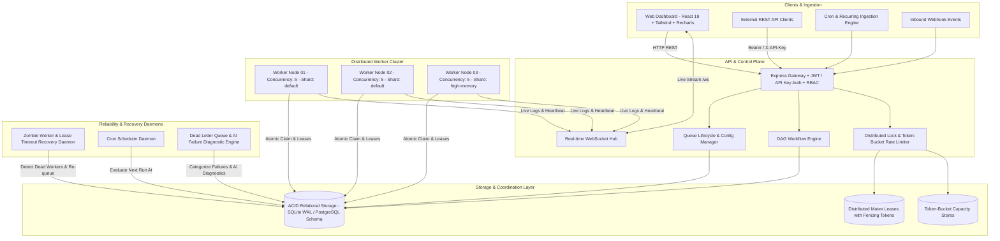
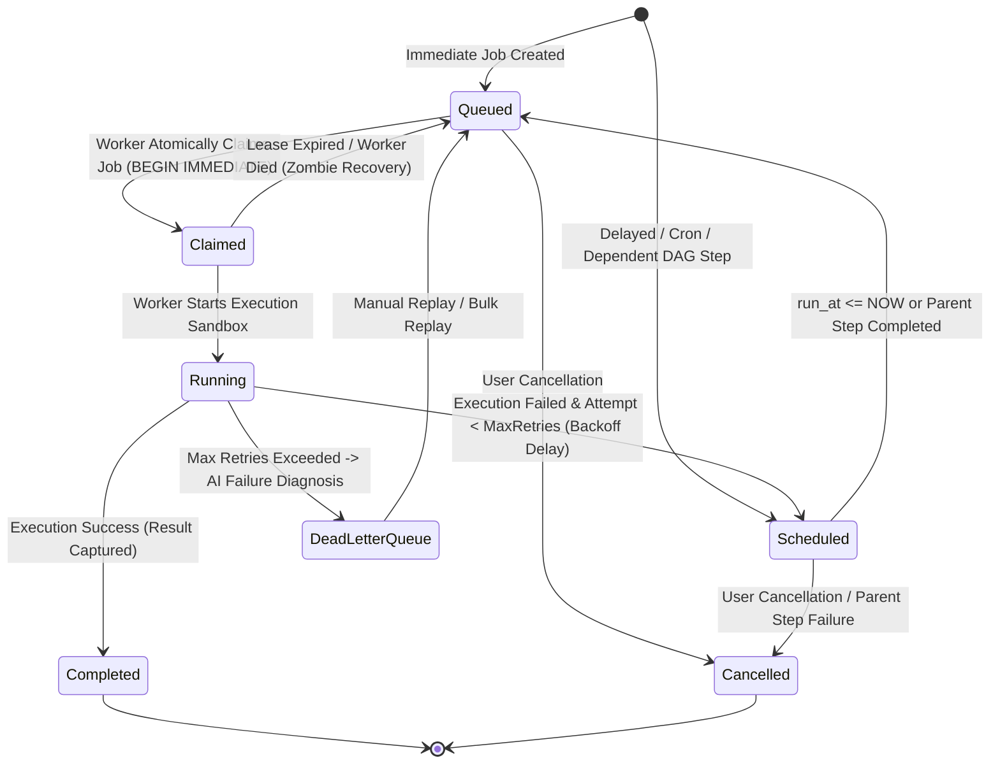

# System Architecture: Codity Distributed Job Scheduler

## 1. High-Level System Architecture

The **Codity Distributed Job Scheduler** is an enterprise-grade background job execution platform designed for high throughput, atomic job claiming, fault tolerance, and multi-tenant isolation.

---

## 2. Job Lifecycle State Machine

Every asynchronous job transitions through a strictly validated state machine to guarantee that each job is processed exactly once per attempt without duplicate execution.

---

## 3. Atomic Job Claiming Algorithm

To eliminate race conditions across multiple distributed worker nodes, job claiming is performed inside an ACID serializable transaction:

1. **Queue Candidate Selection**: Identify all unpaused queues matching the worker's shard tags, ordered by `priority DESC`.
2. **Queue Concurrency & Rate Limit Validation**:
   - Check if current active jobs in queue (`claimed` + `running`) < `queue.concurrency_limit`.
   - Check if token bucket for `queue:{id}` has available capacity.
3. **Atomic Claim Execution**:
   - Query top priority job: `SELECT * FROM jobs WHERE queue_id = ? AND status = 'queued' AND run_at <= NOW ORDER BY priority DESC, run_at ASC, created_at ASC LIMIT 1`.
   - Update job atomically: `UPDATE jobs SET status = 'claimed', worker_id = ?, claimed_at = NOW, attempt_count = attempt_count + 1 WHERE id = ? AND status = 'queued'`.
   - Insert new execution attempt record in `job_executions`.
4. **Transaction Commit**: Returns the exclusively claimed job to the worker thread.

---

## 4. Zombie Worker Detection & Lease Recovery

In distributed systems, workers can crash, lose network connectivity, or experience process starvation.

- **Worker Heartbeat Daemon**: Active workers emit a heartbeat every 3 seconds recording CPU load, memory utilization, and active task count.
- **Zombie Detection**: If a worker has not emitted a heartbeat for > 15 seconds, the `LeaseRecoveryService` marks the worker status as `dead`.
- **Orphaned Job Recovery**:
  - Any job in `claimed` or `running` state whose assigned worker is `dead`, or whose `claimed_at + lease_timeout_ms < NOW`, is automatically reclaimed.
  - If `attempt_count >= max_retries`, the job is routed to the Dead Letter Queue.
  - Otherwise, the job is reset to `queued` with clean state and re-assigned to healthy workers.

---

## 5. Directed Acyclic Graph (DAG) Workflow Engine

The scheduler includes a native dependency orchestrator:

1. **Cycle Detection**: Validates incoming workflows using Kahn's topological sort algorithm to reject graphs with circular dependencies.
2. **Topological Execution**:
   - Root nodes (in-degree = 0) are immediately set to `status = 'queued'`.
   - Downstream dependent child nodes start in `status = 'scheduled'`.
3. **Downstream Propagation**:
   - When a parent job completes, `WorkflowService.onStepCompleted()` evaluates all child edges.
   - Once all incoming dependencies of a child node are satisfied, the child is transitioned to `queued`.
4. **Cascade Failure Protection**: If any parent fails permanently, dependent child tasks are cancelled to prevent inconsistent partial state execution.
