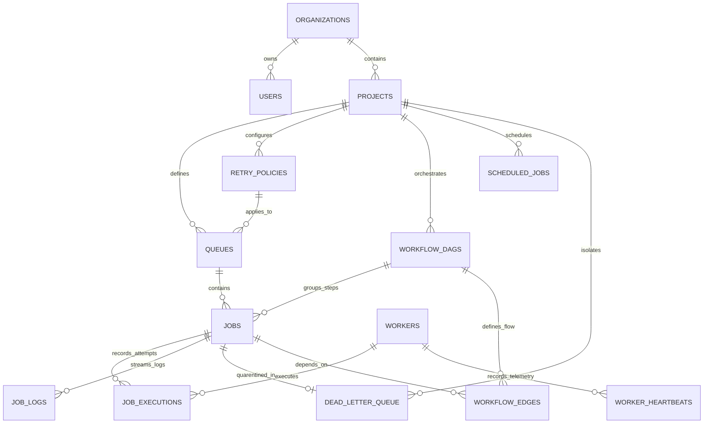

# Database Design & Schema Specification

## 1. Entity-Relationship (ER) Diagram



---

## 2. Table Schemas & Specifications

### 2.1 `organizations`
Multi-tenant root organization entity.
| Column | Type | Constraints | Description |
| :--- | :--- | :--- | :--- |
| `id` | `TEXT` | PRIMARY KEY | Unique Organization UUID |
| `name` | `TEXT` | NOT NULL | Organization display name |
| `slug` | `TEXT` | UNIQUE, NOT NULL | URL-safe slug |
| `plan` | `TEXT` | NOT NULL DEFAULT 'enterprise' | Tier / quota plan |
| `created_at` | `DATETIME` | NOT NULL DEFAULT CURRENT_TIMESTAMP | Created timestamp |
| `updated_at` | `DATETIME` | NOT NULL DEFAULT CURRENT_TIMESTAMP | Updated timestamp |

### 2.2 `users`
User credentials and Role-Based Access Control (RBAC).
| Column | Type | Constraints | Description |
| :--- | :--- | :--- | :--- |
| `id` | `TEXT` | PRIMARY KEY | Unique User UUID |
| `org_id` | `TEXT` | NOT NULL, FK -> organizations(id) ON DELETE CASCADE | Organization reference |
| `email` | `TEXT` | UNIQUE, NOT NULL | User login email |
| `password_hash` | `TEXT` | NOT NULL | Bcrypt salted hash |
| `name` | `TEXT` | NOT NULL | User full name |
| `role` | `TEXT` | NOT NULL CHECK('admin', 'developer', 'viewer') | RBAC Role |
| `api_key` | `TEXT` | UNIQUE, NOT NULL | Bearer / Header API key |
| `is_active` | `INTEGER` | NOT NULL DEFAULT 1 | Active status flag |

### 2.3 `projects`
Project scope grouping queues and workflows.
| Column | Type | Constraints | Description |
| :--- | :--- | :--- | :--- |
| `id` | `TEXT` | PRIMARY KEY | Unique Project UUID |
| `org_id` | `TEXT` | NOT NULL, FK -> organizations(id) ON DELETE CASCADE | Organization reference |
| `name` | `TEXT` | NOT NULL | Project name |
| `slug` | `TEXT` | NOT NULL | Project slug (UNIQUE per org) |
| `description` | `TEXT` | NULL | Optional description |

### 2.4 `retry_policies`
Configurable backoff algorithm configurations.
| Column | Type | Constraints | Description |
| :--- | :--- | :--- | :--- |
| `id` | `TEXT` | PRIMARY KEY | Unique Policy UUID |
| `project_id` | `TEXT` | NOT NULL, FK -> projects(id) ON DELETE CASCADE | Project reference |
| `name` | `TEXT` | NOT NULL | Policy name |
| `strategy` | `TEXT` | NOT NULL CHECK('fixed', 'linear', 'exponential') | Backoff algorithm |
| `base_delay_ms` | `INTEGER` | NOT NULL DEFAULT 1000 | Base delay in milliseconds |
| `max_delay_ms` | `INTEGER` | NOT NULL DEFAULT 60000 | Maximum delay ceiling |
| `max_retries` | `INTEGER` | NOT NULL DEFAULT 3 | Max retry attempts |
| `jitter_factor` | `REAL` | NOT NULL DEFAULT 0.2 | Randomization factor |

### 2.5 `queues`
Queue definitions with priority, concurrency limits, and rate limits.
| Column | Type | Constraints | Description |
| :--- | :--- | :--- | :--- |
| `id` | `TEXT` | PRIMARY KEY | Unique Queue UUID |
| `project_id` | `TEXT` | NOT NULL, FK -> projects(id) ON DELETE CASCADE | Project reference |
| `retry_policy_id` | `TEXT` | FK -> retry_policies(id) ON DELETE SET NULL | Assigned retry policy |
| `name` | `TEXT` | NOT NULL | Queue name (UNIQUE per project) |
| `priority` | `INTEGER` | NOT NULL DEFAULT 5 CHECK(1-10) | Queue base priority |
| `concurrency_limit`| `INTEGER` | NOT NULL DEFAULT 5 | Max active concurrent jobs |
| `rate_limit_per_min`| `INTEGER` | NOT NULL DEFAULT 120 | Token refill budget / min |
| `rate_limit_burst` | `INTEGER` | NOT NULL DEFAULT 20 | Token bucket capacity |
| `is_paused` | `INTEGER` | NOT NULL DEFAULT 0 | Pause flag (1 = paused) |
| `tags` | `TEXT` | DEFAULT '["default"]' | JSON array of worker shards |

### 2.6 `jobs`
Core job state table.
| Column | Type | Constraints | Description |
| :--- | :--- | :--- | :--- |
| `id` | `TEXT` | PRIMARY KEY | Unique Job UUID |
| `queue_id` | `TEXT` | NOT NULL, FK -> queues(id) ON DELETE CASCADE | Target Queue |
| `project_id` | `TEXT` | NOT NULL, FK -> projects(id) ON DELETE CASCADE | Project reference |
| `idempotency_key` | `TEXT` | UNIQUE (project_id, idempotency_key) | Idempotency deduplication key |
| `name` | `TEXT` | NOT NULL | Job descriptive name |
| `job_type` | `TEXT` | NOT NULL CHECK('immediate', 'delayed', 'scheduled', 'cron', 'batch', 'dag_step') | Job type |
| `status` | `TEXT` | NOT NULL CHECK('queued', 'scheduled', 'claimed', 'running', 'completed', 'failed', 'dead_letter', 'cancelled') | Lifecycle status |
| `priority` | `INTEGER` | NOT NULL DEFAULT 5 CHECK(1-10) | Execution priority |
| `payload` | `TEXT` | NOT NULL DEFAULT '{}' | JSON input payload |
| `result` | `TEXT` | NULL | JSON execution output |
| `error_message` | `TEXT` | NULL | Failure message |
| `error_stack` | `TEXT` | NULL | Full error stack trace |
| `run_at` | `DATETIME` | NOT NULL DEFAULT CURRENT_TIMESTAMP | Scheduled execution time |
| `claimed_at` | `DATETIME` | NULL | Lease acquisition timestamp |
| `started_at` | `DATETIME` | NULL | Execution start timestamp |
| `completed_at` | `DATETIME` | NULL | Completion timestamp |
| `lease_timeout_ms` | `INTEGER` | NOT NULL DEFAULT 30000 | Lease expiration duration |
| `worker_id` | `TEXT` | NULL | Assigned worker ID |
| `attempt_count` | `INTEGER` | NOT NULL DEFAULT 0 | Current attempt number |
| `max_retries` | `INTEGER` | NOT NULL DEFAULT 3 | Retry limit |
| `batch_id` | `TEXT` | NULL | Shared batch identifier |
| `dag_id` | `TEXT` | NULL, FK -> workflow_dags(id) ON DELETE CASCADE | Parent workflow |
| `dag_step_name` | `TEXT` | NULL | DAG node identifier |

### 2.7 `job_executions`
Granular historical record of every execution attempt.
| Column | Type | Constraints | Description |
| :--- | :--- | :--- | :--- |
| `id` | `TEXT` | PRIMARY KEY | Execution UUID |
| `job_id` | `TEXT` | NOT NULL, FK -> jobs(id) ON DELETE CASCADE | Job reference |
| `worker_id` | `TEXT` | NOT NULL, FK -> workers(id) ON DELETE CASCADE | Executing worker |
| `attempt_number` | `INTEGER` | NOT NULL | 1-indexed attempt number |
| `status` | `TEXT` | NOT NULL CHECK('running', 'completed', 'failed', 'timeout') | Attempt outcome |
| `started_at` | `DATETIME` | NOT NULL DEFAULT CURRENT_TIMESTAMP | Start time |
| `completed_at` | `DATETIME` | NULL | Finish time |
| `duration_ms` | `INTEGER` | NULL | Latency duration |
| `cpu_usage_pct` | `REAL` | NULL | CPU load recorded |
| `memory_usage_mb` | `REAL` | NULL | Memory allocated |
| `exit_code` | `INTEGER` | NULL | Process exit code |

### 2.8 `dead_letter_queue`
Permanent failure inspection repository with AI diagnosis.
| Column | Type | Constraints | Description |
| :--- | :--- | :--- | :--- |
| `id` | `TEXT` | PRIMARY KEY | DLQ UUID |
| `job_id` | `TEXT` | UNIQUE, NOT NULL, FK -> jobs(id) ON DELETE CASCADE | Quarantined Job |
| `queue_id` | `TEXT` | NOT NULL, FK -> queues(id) ON DELETE CASCADE | Origin queue |
| `project_id` | `TEXT` | NOT NULL, FK -> projects(id) ON DELETE CASCADE | Project scope |
| `failed_at` | `DATETIME` | NOT NULL DEFAULT CURRENT_TIMESTAMP | Quarantine timestamp |
| `failure_reason` | `TEXT` | NOT NULL | Final error reason |
| `ai_root_cause_analysis` | `TEXT` | NULL | JSON: { category, root_cause, explanation, recommended_action, confidence } |
| `status` | `TEXT` | NOT NULL CHECK('unresolved', 'replayed', 'archived') | Triage status |

---

## 3. Indexing & Optimization Strategy

The database includes compound indexes to ensure fast `O(log N)` job claiming and telemetry queries even with hundreds of thousands of jobs:

```sql
-- Fast Job Claiming Index (Priority, FIFO, Scheduled time, Status)
CREATE INDEX idx_jobs_claim ON jobs (queue_id, status, run_at, priority DESC, created_at ASC);

-- State & Multi-tenant Filtering Indexes
CREATE INDEX idx_jobs_status ON jobs (status);
CREATE INDEX idx_jobs_project_status ON jobs (project_id, status);
CREATE INDEX idx_jobs_batch ON jobs (batch_id);
CREATE INDEX idx_jobs_dag ON jobs (dag_id);

-- Zombie Lease Recovery Index
CREATE INDEX idx_jobs_lease ON jobs (status, claimed_at, lease_timeout_ms);

-- Execution & Telemetry History Indexes
CREATE INDEX idx_executions_job ON job_executions (job_id, attempt_number);
CREATE INDEX idx_logs_job ON job_logs (job_id, timestamp ASC);
CREATE INDEX idx_workers_heartbeat ON workers (status, last_heartbeat_at);
CREATE INDEX idx_scheduled_next_run ON scheduled_jobs (is_active, next_run_at);
CREATE INDEX idx_dlq_project_status ON dead_letter_queue (project_id, status);
```
